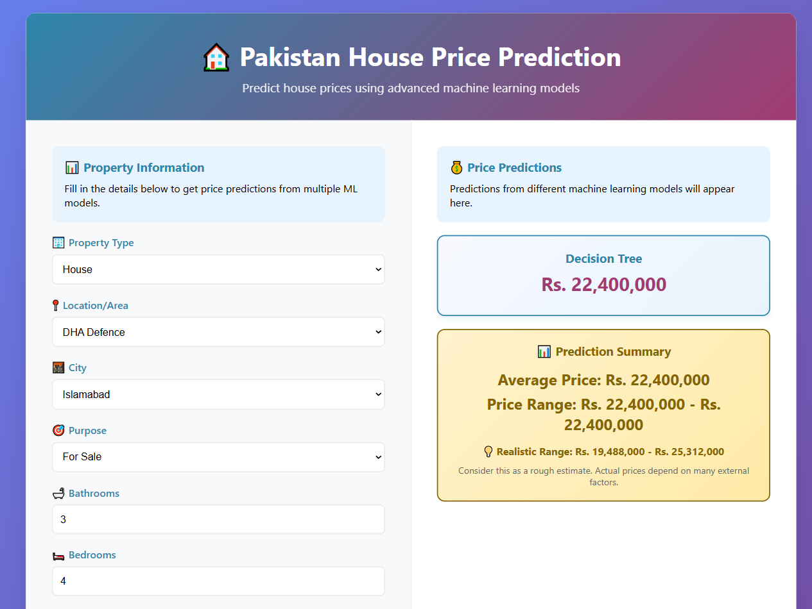

# Pakistan House Price Prediction

Regression project that estimates house prices in Pakistani cities from property type, location, city, purpose, bathrooms, bedrooms, and area. The saved web app uses a decision tree trained on the included listing dataset.

## See it working

This example is a house for sale in DHA Defence, Islamabad, with 3 bathrooms, 4 bedrooms, and 2,500 sq ft.



## Method

The notebook `pakistan-house-price-prediction.ipynb` cleans the listings, drops duplicates, converts area, encodes categorical fields, and scales the numeric fields. It compares a decision tree with random forest, gradient boosting, and XGBoost. The Flask app in this repository loads the saved decision tree from `models/`.

## Run the web app

```bash
pip install flask pandas numpy scikit-learn
python flask_app.py
```

Open `http://127.0.0.1:5000`.

`train_and_save_models.py` retrains the models. `streamlit run app.py` starts the Streamlit version of the same form.

## Stack

Python, pandas, scikit-learn, Flask, Streamlit
